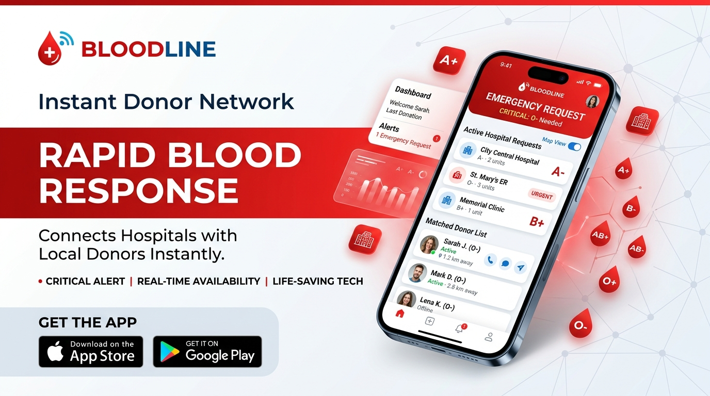
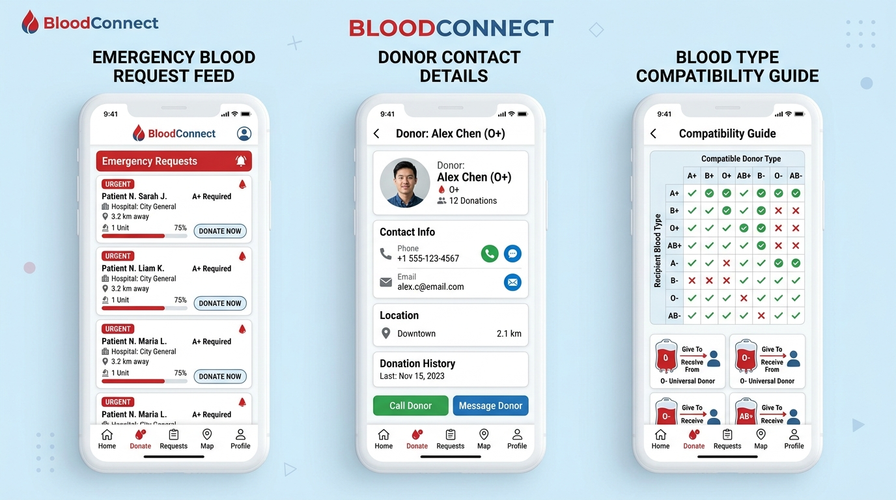

# 🩸 KanBağı - Acil Kan Bağışı ve İlan Platformu

[](https://reactjs.org/)
[](https://www.typescriptlang.org/)
[](https://firebase.google.com/)
[](https://tailwindcss.com/)
[](LICENSE)

> **"1 Ünite Kan, 3 Can Kurtarır."**  
> Acil kan ihtiyacı olan hasta ve hasta yakınları ile gönüllü bağışçıları doğrudan ve gerçek zamanlı olarak bir araya getiren, **%100 Açık Kaynaklı (Open Source)**, mağaza indirmesi gerektirmeden tarayıcıdan ve mobilden anında çalışan web ve mobil platformu.

---

## 🌐 Açık Kaynak & Doğrudan Web Erişimi

KanBağı tamamen **açık kaynaklı** bir sosyal sorumluluk ve sağlık projesidir:
- **Mağaza İndirmesi Yok:** App Store veya Google Play Store'dan herhangi bir uygulama indirmeye gerek kalmadan, doğrudan mobil tarayıcılardan (PWA uyumlu) tek tıkla çalışır.
- **Topluluk Odaklı:** Kâr amacı gütmez, veriler hasta ile bağışçı arasında doğrudan iletişim kurulması için kullanılır.
- **Şeffaf & Bağımsız:** Tüm kaynak kodları, güvenlik kuralları ve veritabanı şemaları kamuya açıktır ve geliştiricilerin katkısına açıktır.

---

## 📸 Ekran Görüntüleri ve Arayüz Önizlemesi


*Mobil cihazlar için optimize edilmiş acil çağrı akışı, kan grubu eşleşmesi ve doğrudan irtibat paneli.*


*Acil Kan İlanları Akışı, Gönüllü Bağışçı Havuzu ve Kan Grubu Medikal Uyumluluk Matrisi.*

---

## 🌟 Öne Çıkan Özellikler

### 1. 🚨 Acil Kan İlanı Verme ve Yönetimi
- **Aciliyet Derecelendirmesi:** 
  - `🚨 Çok Acil (Hayati)`
  - `⚠️ 24 Saat İçinde`
  - `📅 Planlı Ameliyat`
- **Tüm Kan Bileşenleri Desteği:** Tam Kan, Trombosit (Aferez), Eritrosit Süspansiyonu, Taze Donmuş Plazma.
- **İhtiyaç / Temin Takibi:** Kaç üniteye ihtiyaç duyulduğu ve kaç ünitesinin bulunduğu gerçek zamanlı takip edilebilir.
- **Konum ve Hastane:** 81 il ve ilçe seçeneği ile hastane bilgisi.

### 2. 📞 Doğrudan İletişim & WhatsApp Entegrasyonu
- **Tek Tıkla Arama:** Bağışçılar, hasta yakınının telefon numarasını doğrudan arayabilir (`tel:` protokolü).
- **Hızlı WhatsApp Mesajı:** Otomatik doldurulan hazır mesaj şablonuyla ("*KanBağı üzerinden A+ ilanınız için ulaşıyorum...*") anında mesajlaşma.
- **İkinci / Yedek Telefon:** Ulaşılamama durumlarına karşı yedek numara desteği.

### 3. 🤝 "Ben Kan Verebilirim" Gönüllü Yanıtları
- İlanı gören bağışçılar ilan altına hızlıca telefon numarası ve not bırakabilir.
- Hasta yakını, ilana yanıt veren tüm bağışçıları liste halinde görür ve doğrudan arayabilir.

### 4. 🩸 Gönüllü Bağışçı Havuzu
- Kullanıcılar kan grupları, şehirleri ve iletişim bilgileriyle kalıcı bağışçı listesine kaydolabilir.
- **Aferez (Trombosit) Bağışı Seçeneği:** Lösemi ve onkoloji hastaları için özel aferez bağışçı filtrelemesi.

### 5. 🔬 İnteraktif Kan Grubu Uyumluluk Matrisi
- Medikal kurallara göre hangi kan grubunun **kimlerden kan alabileceği** ve **kimlere kan verebileceği** görsel olarak listelenir.
- Genel verici (0 Rh-) ve genel alıcı (AB Rh+) bilgileriyle kullanıcıları bilinçlendirir.

---

## 🛠️ Teknoloji Yığını

- **Frontend:** React 19, TypeScript, Vite
- **Stil & Tasarım:** Tailwind CSS v4, Lucide React İkon Seti, Canvas-Confetti
- **Veritabanı & Altyapı:** Google Cloud & Firebase Firestore (Realtime Snapshots)
- **Güvenlik:** Yapılandırılmış Firestore Güvenlik Kuralları (`firestore.rules`)

---

## 🚀 Kurulum ve Yerel Geliştirme

Projeyi yerel ortamınızda çalıştırmak için aşağıdaki adımları izleyin:

### Gereksinimler
- Node.js (v18 veya üzeri)
- npm veya bun

### 1. Depoyu Klonlayın
```bash
git clone https://github.com/kullaniciadi/kanbagi-platformu.git
cd kanbagi-platformu
```

### 2. Bağımlılıkları Yükleyin
```bash
npm install
```

### 3. Firebase Yapılandırması
Kök dizindeki `firebase-applet-config.json` dosyasında Firebase Firestore bilgilerinizi tanımlayın:
```json
{
  "projectId": "your-firebase-project-id",
  "appId": "your-app-id",
  "apiKey": "your-api-key",
  "authDomain": "your-project.firebaseapp.com",
  "firestoreDatabaseId": "(default)",
  "storageBucket": "your-project.firebasestorage.app",
  "messagingSenderId": "your-sender-id"
}
```

### 4. Geliştirme Sunucusunu Başlatın
```bash
npm run dev
```
Uygulama varsayılan olarak `http://localhost:3000` adresinde çalışacaktır.

### 5. Canlıya Alma (Production Build)
```bash
npm run build
```

---

## 📂 Proje Dizin Yapısı

```
├── public/                 # Statik varlıklar
├── src/
│   ├── assets/images/      # Uygulama ekran görüntüleri ve banner görselleri
│   ├── components/         # Modüler UI bileşenleri
│   │   ├── BloodCompatibilityGuide.tsx  # Uyumluluk rehberi
│   │   ├── BloodRequestCard.tsx         # İlan kartı bileşeni
│   │   ├── CreateRequestModal.tsx       # Acil ilan oluşturma formu
│   │   ├── DonorsTab.tsx                # Gönüllü bağışçı listesi ve filtresi
│   │   ├── RegisterDonorModal.tsx       # Bağışçı olma formu
│   │   └── RequestDetailModal.tsx       # İlan detayı, arama ve WhatsApp aksiyonları
│   ├── services/
│   │   └── bloodService.ts # Firestore gerçek zamanlı CRUD servisleri
│   ├── types.ts            # TypeScript veri modelleri ve kan grupları
│   ├── firebase.ts         # Firebase SDK başlatıcısı
│   ├── seedData.ts         # İlk açılış veri tohumlayıcısı
│   ├── App.tsx             # Ana uygulama ekranı ve tab yönetimi
│   └── main.tsx            # React giriş noktası
├── firestore.rules         # Firebase güvenlik kuralları
├── package.json
└── README.md
```

---

## 🔒 Güvenlik Kuralları (Firestore Security Rules)

İlan oluşturma esnasında veri bütünlüğünü sağlamak adına `firestore.rules` dosyasında sıkı tip kontrolleri uygulanır:

```javascript
rules_version = '2';
service cloud.firestore {
  match /databases/{database}/documents {
    match /blood_requests/{requestId} {
      allow read: if true;
      allow create: if request.resource.data.patientName is string &&
                      request.resource.data.bloodType is string &&
                      request.resource.data.unitsNeeded is int &&
                      request.resource.data.phone is string &&
                      request.resource.data.city is string &&
                      request.resource.data.hospital is string;
      allow update, delete: if true;
    }
    match /donors/{donorId} {
      allow read, write: if true;
    }
    match /blood_requests/{requestId}/responses/{responseId} {
      allow read, write: if true;
    }
  }
}
```

---

## 🤝 Katkıda Bulunma

1. Bu depoyu Fork edin (`Fork` butonuna basın)
2. Yeni bir özellik dalı oluşturun (`git checkout -b feature/YeniOzellik`)
3. Değişikliklerinizi commit edin (`git commit -m 'feat: Yeni özellik eklendi'`)
4. Dalınıza push edin (`git push origin feature/YeniOzellik`)
5. Bir **Pull Request (PR)** açın

---

## 📄 Lisans

Bu proje [Apache-2.0 License](LICENSE) altında lisanslanmıştır. İnsani yardım ve hayat kurtarma amacıyla açık kaynak olarak geliştirilmiştir.
